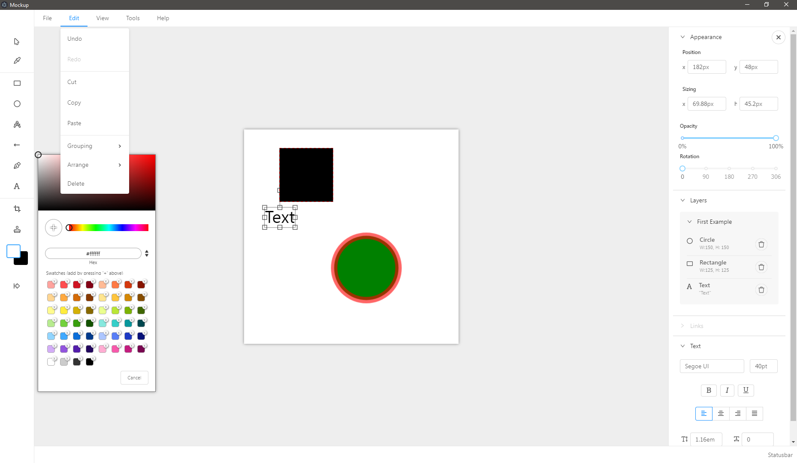

**Abandoned**. There is other software that accomplishes the same goal. 

**Current status**: A very basic vector editor in Electron.

-------

# Mockup (Working title)

An application for making mockups and exporting them to an easily viewable html page.

## How?

Artboards in your project are saved as JSON and then saved inside a HTML page.

Main benefits of this approach:
 - Preview your project locally or via a webserver inside any browser window!
 - You can easily spice up your mockups if you know some HTML/CSS

# Development

See [COMMANDS](./commands.md) for useful commands like running the application.

You can deactivate "Developer Tools" by commenting `win.webContents.openDevTools();` in `main.ts`.

Your application is optimized. Only /dist folder and node dependencies are included in the executable.

Boilerplate used: https://github.com/maximegris/angular-electron

## Browser mode

Maybe you want to execute the application in the browser with hot reload ? You can do it with `npm run ng:serve:web`.  
Note that you can't use Electron or NodeJS native libraries in this case. Please check `providers/electron.service.ts` to watch how conditional import of electron/Native libraries is done.
